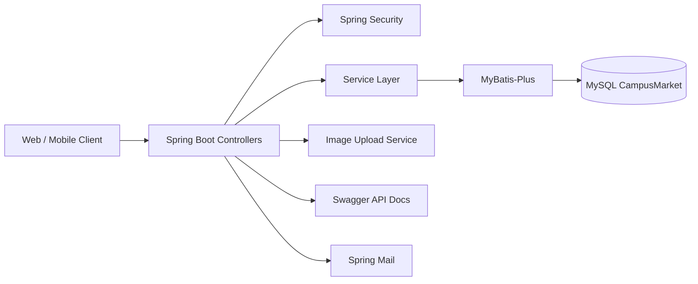
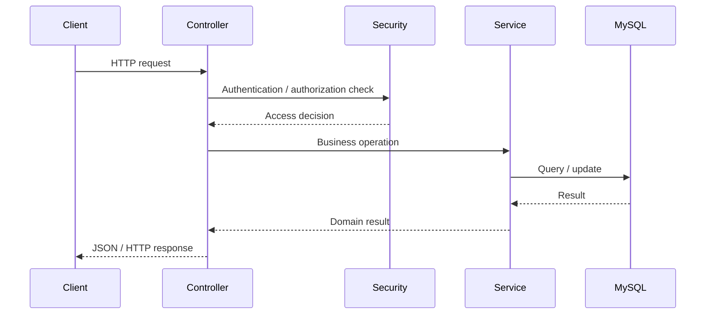

<div align="center">

# CampusMarket
### Campus Marketplace Backend Built with Spring Boot


</div>

## Overview

**CampusMarket** is an earlier Java backend project for a campus-oriented marketplace service. It was developed as practical training in building a structured Spring Boot web application with authentication, database persistence, user/order administration, file uploads, API documentation, and server-side service organization.

The public code contains distinct controllers for **users, administrators, orders, uploads, and index/general endpoints**, making the project more substantial than a simple database exercise.

## Architecture



## Main API Areas

The codebase includes the following controller groups:

| Controller | Base path / role | Purpose |
| --- | --- | --- |
| `TUserController` | `/user` | User-facing operations |
| `TAdminController` | `/admin` | Administrative operations |
| `TOrderlistController` | `/orderlist` | Order-list workflows |
| `UploadController` | `/upload` | Image upload handling |
| `IndexController` | General/index API | Common or landing-related service endpoints |

Swagger annotations are used on the controllers so the original project can expose human-readable API documentation in a development environment.

## Tech Stack

Based on the Maven configuration, the backend uses:

- **Java 11**
- **Spring Boot 2.6.6**
- Spring Web
- Spring Security
- Thymeleaf
- Spring Mail
- MySQL Connector/J
- MyBatis-Plus + code generator
- Swagger / Springfox 2.9.2
- Velocity template engine
- Hutool utilities
- Lombok
- Maven

## Request Flow



## Repository Structure

```text
west2_campusMarket/
└── campusMarket/
    ├── pom.xml
    └── src/
        ├── main/java/com/west2/test6_4/
        │   ├── controller/        # User/admin/order/upload/index APIs
        │   ├── service/           # Business logic
        │   ├── entity/            # Persistent/domain entities
        │   ├── mapper/            # MyBatis-Plus data access
        │   └── config/            # Security / Swagger / application config
        └── main/resources/
            ├── application.yml
            └── mappers/
```

## File Uploads

`UploadController` exposes image-upload functionality. The application configuration accepts image MIME types including JPEG, PNG, JPG, and BMP. The current README-friendly configuration uses an environment-overridable upload directory instead of a machine-specific absolute path.

## Configuration

The current version uses environment variables for sensitive/local configuration:

```bash
export CAMPUSMARKET_DB_URL="jdbc:mysql://localhost:3306/CampusMarket?useUnicode=true&characterEncoding=UTF-8&serverTimezone=GMT%2B8&useSSL=false"
export CAMPUSMARKET_DB_USER="root"
export CAMPUSMARKET_DB_PASSWORD="<your-password>"
export CAMPUSMARKET_UPLOAD_PATH="./uploads/"
export CAMPUSMARKET_PORT="8099"
```

> Historical versions contained a development database password and machine-specific upload path directly in `application.yml`. The current version has been parameterized; any previously exposed credential should be rotated before reuse.

## Getting Started

```bash
cd campusMarket
mvn clean package
mvn spring-boot:run
```

Before starting the service:

1. Create the `CampusMarket` MySQL database and required tables/schema.
2. Set the database environment variables above.
3. Create the configured upload directory.
4. Start the Spring Boot application.
5. Use the Swagger UI exposed by the project configuration to inspect available endpoints.

## What This Project Demonstrates

- Layered Spring Boot backend design.
- User/admin/order-oriented REST APIs.
- Authentication and authorization with Spring Security.
- Relational persistence with MySQL + MyBatis-Plus.
- File/image upload handling.
- API documentation with Swagger.
- Mail integration and utility-library usage.
- Configuration and dependency management with Maven.

## Portfolio Context

CampusMarket represents an early backend-engineering project before my research shifted toward **graph learning, spatiotemporal intelligence, LLMs, and Agentic AI**. I keep it public as evidence of practical Java service development and system organization.

## Author

**Bo Liu**  
Contact: `liubo317@hnu.edu.cn`  
Homepage: https://boliupro.github.io
